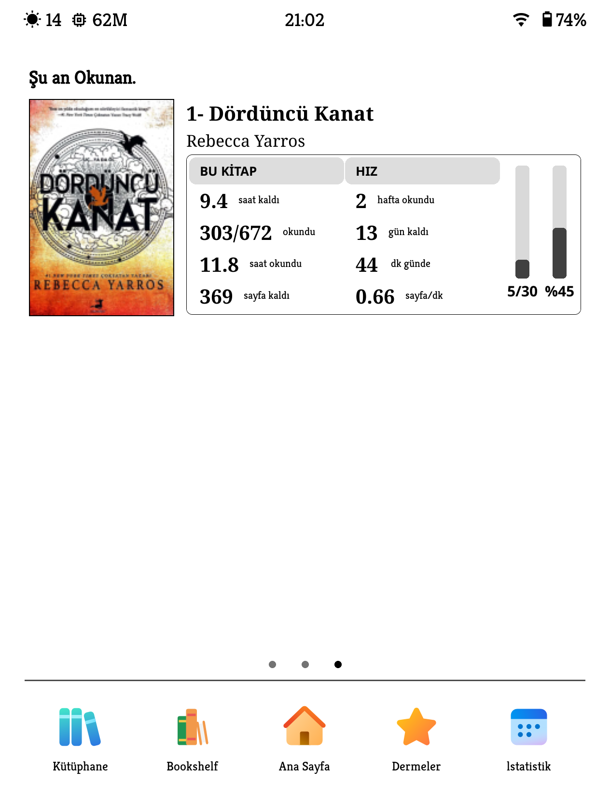

# koreader-enhanced-currently-reading

  

# 📖 Enhanced Currently Reading (SimpleUI Dashboard Module)

Enhanced Currently Reading is a completely redesigned, highly detailed, and fully dynamic reading statistics dashboard module. This module (`module_currently_yanllsama.lua`) is built as an extension for the `simpleui_ext.koplugin` to provide a premium, modern reading dashboard on KOReader.

While maintaining the solid foundation of the original concept, it offers enriched data, gorgeous modern design, dynamic grid management, vertical progress tracking, and flexible interface options. It features a crash-safe architecture fully compatible with the KOReader UI engine.

---

## ✨ Features

### 🎨 Modern & Aesthetic Design
* **Redesigned UI**: Enjoy a premium, modern layout where statistics and vertical bars are elegantly grouped inside a thinly outlined, rounded capsule-style table.
* **Full Typographic Control**: Completely customize the font family, font size, and font weight (Normal/Bold) for Book Titles, Author Names, Labels, and Data Numbers.
* **Pill-Shaped Progress Bars**: Visually pleasing, fully rounded capsule-style vertical bars. 

### 🖼️ Seamless CoverDeck Integration
* **Visual Harmony**: Integrates perfectly with CoverDeck to fetch and display high-quality book covers directly on your KOReader home screen.
* **Gesture Controls**: Simply use a **swipe up/down gesture** on the cover image area to smoothly interact with the CoverDeck features!

### 📈 Vertical Progress Bars & Daily Goals
* **Daily Page Goal**: Set a daily reading target (e.g., 50 pages) and watch your progress fill up a dedicated vertical bar.
* **Adjustable Bar Thickness**: Choose from 4 different thickness levels (Thin, Normal, Bold, Extra Bold) for your vertical bars.

### 📐 Fully Dynamic Grid System
* **Custom Layouts**: Say goodbye to fixed templates! Freely determine the layout of the statistics on your screen by selecting the Number of Columns (1-3) and Number of Rows (1-5).
* **Customizable Category Headers**: Change the text of the column headers (e.g., THIS BOOK, SPEED, EXTRA 1). You can also adjust the header thickness (Thin, Medium, Bold) or hide them completely.

### 📊 Rich Statistics
Deeply analyze your reading habits with:
* Time Left & Time Spent
* Pages Read & Pages Left
* Days Reading & Days to Go
* Daily Average & Pages/Minute Speed
* Last Session Pages

### 🎛️ Full Control (Edit Items)
* **Toggle & Sort**: Show or hide any statistic you want. Rearrange the display order exactly as you like. Your dynamic grid will automatically populate based on this order.

### ℹ️ Smart Info Screen & Insights
* **Book Blurb**: Avoids cluttering the screen with buttons. Tap on the Book or Author name to open an elegant info window displaying the book's blurb/summary.
* **Reading Insights**: Tap directly on the statistics area to bring up the detailed Reading Insights popup (if the patch is installed).

---

## 📥 Installation

This module requires the `simpleui_ext.koplugin` to function correctly. 

**Step 1: Install `simpleui_ext.koplugin` (if you haven't already)**
1. Download the `simpleui_ext.koplugin` package.
2. Connect your e-reader to your computer.
3. Extract and copy the entire `simpleui_ext.koplugin` folder to your KOReader plugins directory:
   `koreader/plugins/`

**Step 2: Install this Enhanced Module**
1. Download the `module_currently_yanllsama.lua` file from this repository.
2. Copy the downloaded file into the desktop modules directory of the plugin:
   `koreader/plugins/simpleui_ext.koplugin/desktop_modules/`

**Step 3: Enable the Plugin in KOReader**
1. Safely disconnect your e-reader and open KOReader.
2. Open the top menu and navigate to **Tools (Wrench/Gear icon) -> Plugin Management**.
3. Find the SimpleUI Ext plugin in the list and check the box to enable it.
4. **Restart KOReader** for the changes to take effect.
5. Once restarted, ensure the module is active in the SimpleUI settings menu.

---

## ⚙️ How to Use & Settings

All settings are configured via the SimpleUI configuration menu (Wrench icon -> Currently Reading):

* **CoverDeck Gesture**: Simply **Swipe Up or Down** on the book cover to interact with CoverDeck.
* **Grid Settings**: Select how many columns and rows of statistics you want, and configure the Category Headers.
* **Edit Statistics Items**: Toggle the visibility of statistics and change their order.
* **Text and Font Settings**: Grouped settings for "Book and Author", "Data", and "Labels" to fine-tune your typography.
* **Vertical Bar Settings**: Adjust the height, thickness, and font of the vertical progress bars.
* **Daily Page Goal**: Set your target reading pages for the day to fill the vertical progress bar.
* **Time Format**: Set the time display format as Readable (e.g., 3.5 hours) or XhYm (e.g., 3h 30 min).

---

## 📝 Change Log

**v2.0.0 (Latest)**
* **Added**: Full CoverDeck integration with swipe up/down gesture support.
* **Added**: Vertical data bars tracking daily page goals and total book progress.
* **Added**: Complete UI overhaul with rounded frames and a boxed statistics layout.
* **Added**: Dedicated "Text and Font Settings" menu to fully customize typography (font face, size, and weight).
* **Added**: Deep localization support (fully compatible with `tr.po` for Turkish).
* **Improved**: Restructured the Settings Menu into logical sub-menus (Grid Settings, Bar Settings, etc.).
* **Renamed**: Official module name updated to `module_currently_yanllsama.lua` for use with `simpleui_ext.koplugin`.

**v1.0.0 (Original Release)**
* Initial release with dynamic grid system.
* Basic statistic visibility and sorting controls.
* Smart Info Screen for book summaries.

---

*This module was developed by Yanllsama, based on the original open-source codes, to contribute to the KOReader and SimpleUI community. This project is licensed under the MIT License. You are free to use, modify, and distribute the code as you wish. Feedback and Pull Requests are always welcome!*
