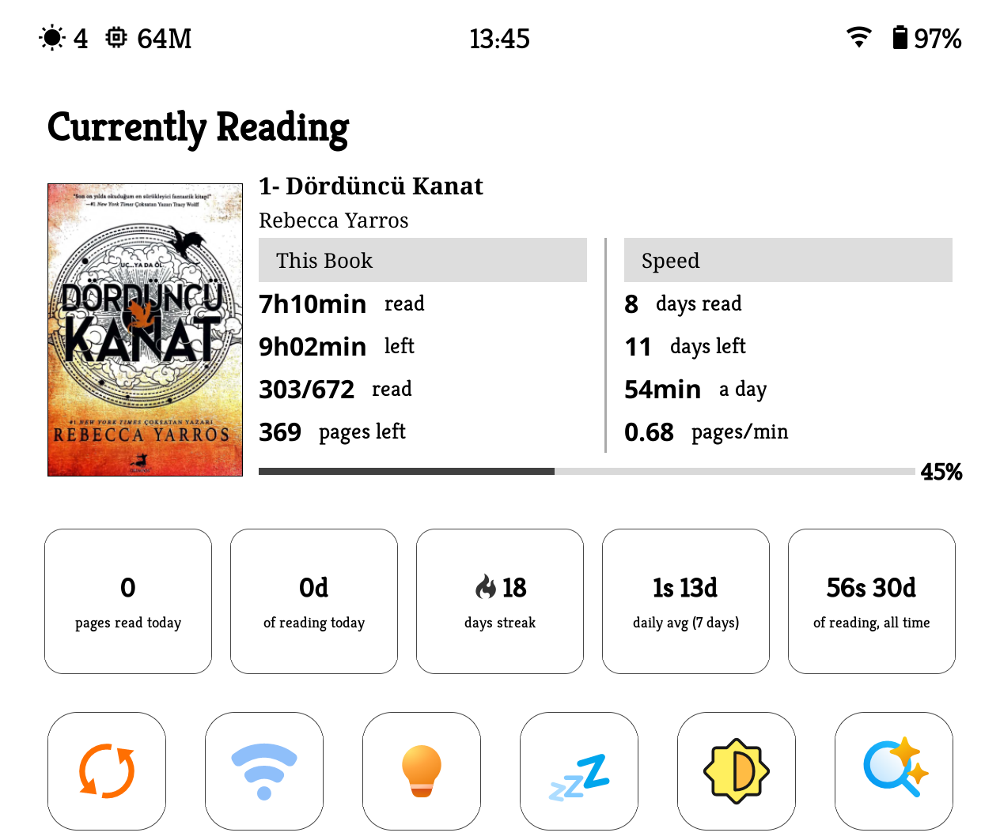

# koreader-enhanced-currently-reading

  

# 📖 Enhanced Currently Reading (SimpleUI Dashboard Module)

**Enhanced Currently Reading** is a completely redesigned, highly detailed, and **fully dynamic** reading statistics dashboard module intended to replace the original `module_currently.lua` file for KOReader's popular SimpleUI plugin.

While maintaining the solid foundation of the original module, it offers enriched data, brand new progress bar designs, dynamic grid management, and flexible interface options. It features a crash-safe architecture fully compatible with the KOReader UI engine.

## ✨ New and Dynamic Features

* **📐 Fully Dynamic Grid System:** Say goodbye to fixed templates! You can now freely determine the layout of the statistics on your screen by selecting the **Number of Columns (1-4)** and **Number of Rows (1-6)**.
* **🏷️ 4 Customizable Category Headers:** You can easily change the text of the headers that appear on the screen based on the number of columns you choose (e.g., *THIS BOOK*, *SPEED*, *EXTRA 1*, *EXTRA 2*). You can also adjust the header thickness or hide them completely.
* **📊 Rich Statistics:** Deeply analyze your reading habits.
  * Time Left & Time Spent
  * Pages Read & Pages Left
  * Days Reading & Days to Go
  * Daily Average & Pages/Minute Speed
  * **(New!)** Last Session Pages
* **🎨 Advanced Progress Bars:** Choose the progress bar that fits your style. Options: *Simple, With percentage, Bold, Minimal, Outline*, and *Segmented*.
* **🎛️ Full Control (Edit Items):** Show or hide any statistic you want. Rearrange the display order of the items exactly as you like. Your dynamic grid will automatically populate based on this order.
* **ℹ️ Smart Info Screen:** It avoids cluttering the screen with buttons. When you tap on the Book or Author name, an elegant info window (InfoMessage) opens displaying the book's blurb/summary

## 📥 Installation

This module updates a part of the original SimpleUI plugin. To install it, you need to overwrite the original file.

1. Download the `module_currently.lua` file from this repository.
2. Connect your e-reader to your computer.
3. Navigate to the directory where the SimpleUI modules are located on your device. This path is usually:
   `koreader/plugins/simpleui.koplugin/desktop_modules/`
4. *(Optional)* Just in case, make a backup of the original `module_currently.lua` file located in that folder.
5. Copy the new `module_currently.lua` file you downloaded into this folder and overwrite the existing file.
6. Safely disconnect your device and completely close and reopen KOReader (or reboot the device).

## ⚙️ How to Use & Settings

All settings are configured via the SimpleUI configuration menu (Wrench icon -> Currently Reading):

* **Grid Dimensions:** Select how many columns and rows of statistics you want to fit on the screen.
* **Category Headers:** Change the top header names for the 1st, 2nd, 3rd, or 4th columns depending on your layout.
* **Edit Items:** Toggle the visibility of statistics and change their order (Sort Items). 
* **Progress bar style:** Change the design of your progress bar here.
* **Time Format:** Set the time display format as *Readable (e.g., 3.5 hours)* or *XhYm (e.g., 3h 30 min)*.

* This module was developed by Yanllsama, based on the original open-source codes, to contribute to the KOReader and SimpleUI community.

This project is licensed under the MIT License. You are free to use, modify, and distribute the code as you wish. Feedback and Pull Requests are always welcome!
